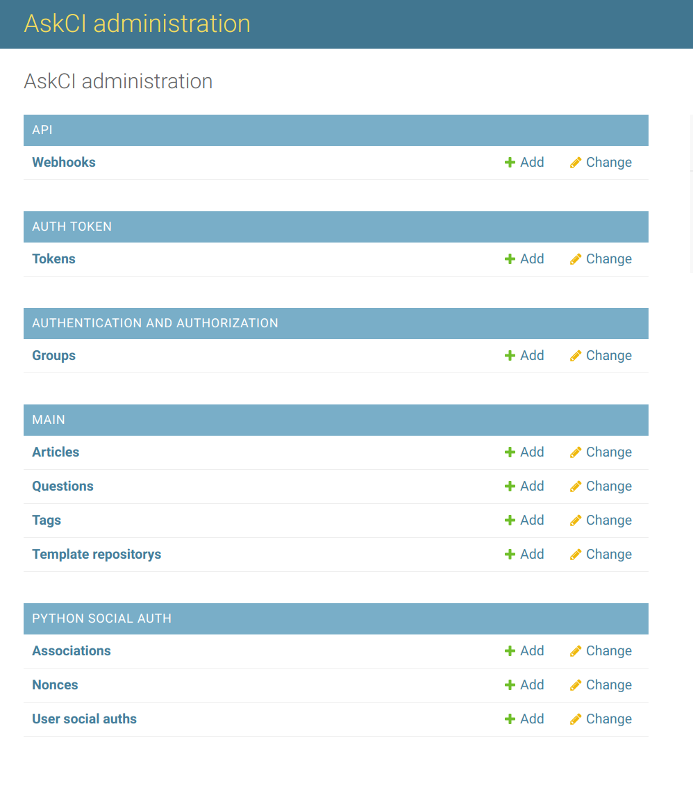
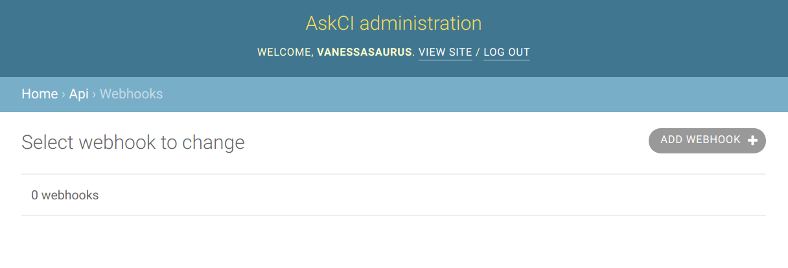

# Admin

## Adding Admins

In order to see admin interfaces, you need to first login with GitHub,
and then shell into the container to add your username to the staff and superuser groups.

```bash
$ docker exec -it askci-dev_base bash    # development
$ docker exec -it askci_base bash        # production
$ python manage.py add_staff vsoch
$ python manage.py add_superuser vsoch
```

You can also remove users accordingly:

```bash
$ python manage.py remove_staff vsoch
$ python manage.py remove_superuser vsoch
```

Once you've done this, an "Admin" link should appear in the navigation. You can then
see the AskCI Administrative view, where the API Webhooks model can be interacted with
directly.




## Webhooks

AskCI Server is currently set up to handle incoming webhooks for the following
providers:

 - discourse

If you are an admin or super user, you can navigate to the admin interface and click on 
"Webhooks" to see a view with a button to "Add Webhook"



For any webhook provider, click on "Add Webhook" to add a new webhook. Since
each provider has a specific payload and method, continue reading below for provider-specific
instructions. If you want to request the addition of a new provider, please [open an issue]({{ site.repo }}/issues/new).

### Discourse

Click on the "Add Webhook" button shown previously. This will show a simple interface with a secret,
and name that you will fill in. Under the name, put the full name of the discourse instance, e.g:

```
https://ask.cyberinfrastructure.org
```

and click save.
Under discourse, you'll need to be an admin, and navigate to Admin -> API -> Webhooks and click to add a new webhook.
Fill in the following fields as follows:

 - Payload URL: https://askci.dev/api/webhook/receive (or replace with your server name)
 - Content Type: application/json
 - Secret: Copy paste the secret from the add webhook view on your server
 - Events: Post Event is the default (leave it checked)
 - Trigger Categories: It's suggested to just put Q&A
 - Check TLS Certificate: keep this checked
 - Active: check after you've saved the webhook on your server.

If you need more detail about webhooks, [see this post](https://meta.discourse.org/t/setting-up-webhooks/49045).
