# Getting Started

If you are interested in developing or setting up the server, see the [development docs]({{ site.baseurl }}/docs/development/).

## Home

When you browse to the site, (let's say it's served locally at http://127.0.0.1) you'll see a listing of the most 
recent questions, and corresponding articles. This screen shot only shows one article about
Singularity containers.

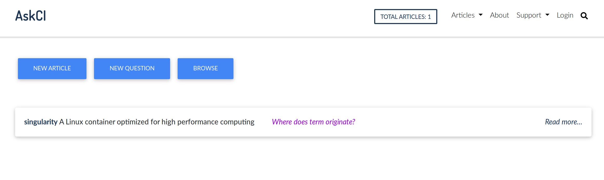

Notice that I can easily request to create a new article, browser, or ask a question.

Browsing takes me to a similar view, except we are viewing a listing of just the articles.

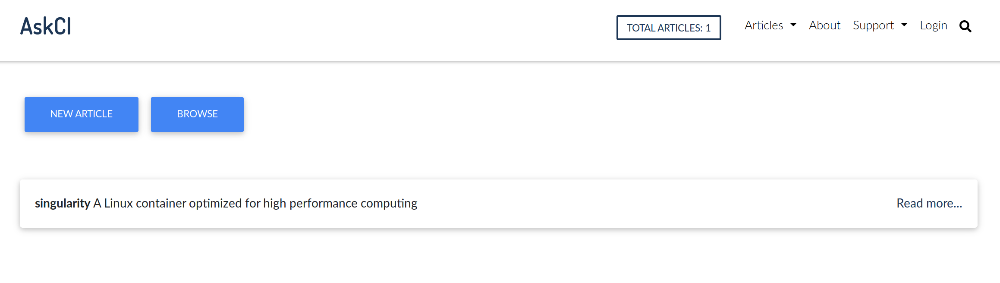

What you cannot see in both of these limited listings is that the pages support infinite scroll.

## Articles

If we click on an article to view, we see a simple interface that provides tabs to:

 - view the rendered article
 - view questions indexed for the article
 - view reviews in progress on GitHub
 - navigate directly to the connected repository

Also notice in the pictures below that the user can export the article (as text markdown)
or as json with complete metadata.

### Rendered Article

The rendered article (the current version on the master branch of the repository)
is shown first.

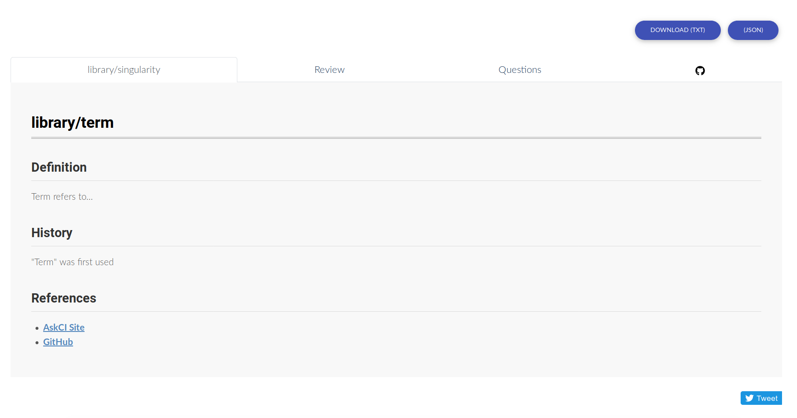

### Review

If previous users have submit requests for changes (meaning they have edited the article in
the interface, and clicked submit) then these pull requests are listed under review. 

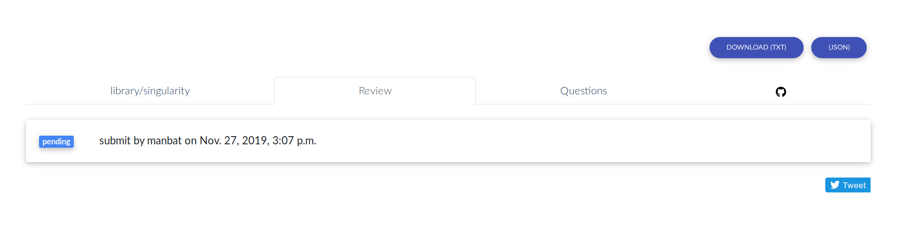

Another visiting user can easily click on one of the articles to be reviewed to give feedback
on the suggested updates. And of course when the PR is merged to update the master branch,
the content on the server is updated.

### Questions

If we navigate to the Questions tab, we see all embedded questions in the article.
If we click a question, we are taken directly to the spot in the article where it's rendered.

These questions are indexed in the database and updated with the articles, meaning that
a user can easily search to find an answer, or (via an external tool that works with the API)
quickly see an answer. 

### Examples

This same logic works for an "examples" tab that can return snippets
of code for the user to see an example for.

## Logging In

The view that isn't viewable without authentication is to edit an article directly. We need
to login first!

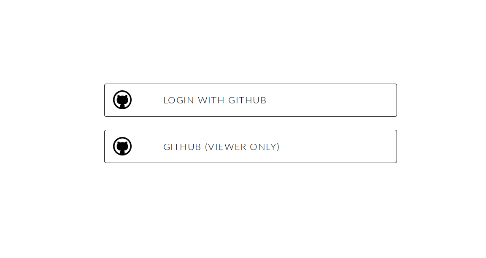

Once we are logged in, we can see our profile (with an API token to use the API)

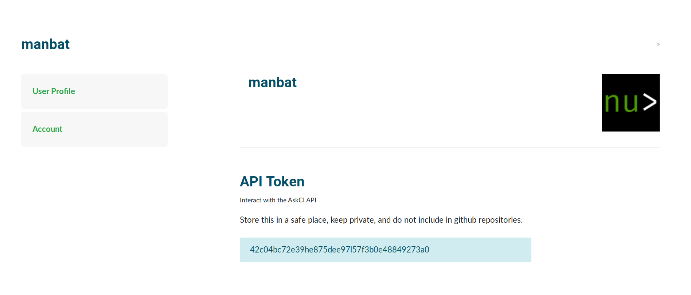

or an accounts page to delete our account.

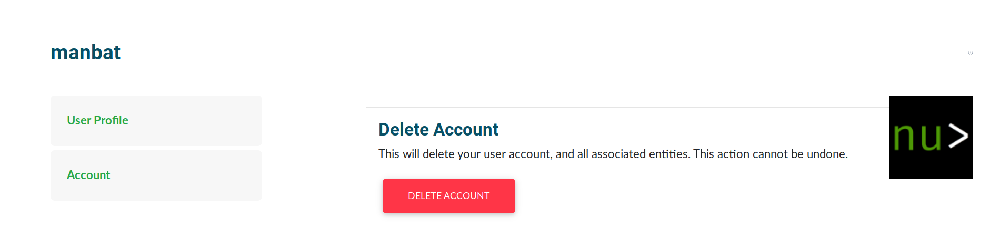

## Edit an Article

And of course, once we are authenticated we can return to the article to see the "Edit" tab!

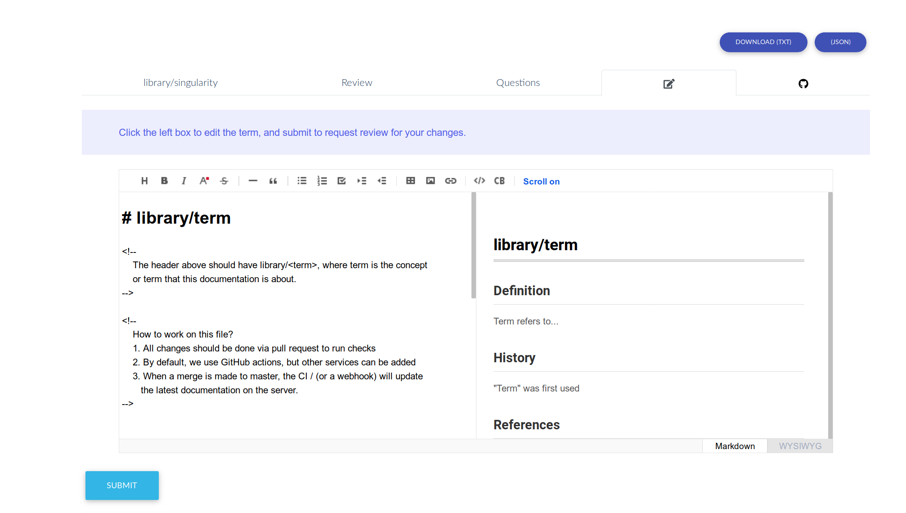

It's a basic markdown editor where you write on the left side, and the rendered content appears on the right.
When you are ready to submit your changes for review (opening a pull request to the repository)
you can click submit.

 - Each user is only allowed one open request for review per article at a time
 - The user must be authenticated

On the right side, there is an "Add a Question" button. This is how you would embed a question
into the markdown:

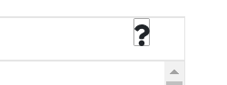

Clicking it will open a modal where you can enter your question. It will be inserted 
in the markdown at the point where the cursor currently is.

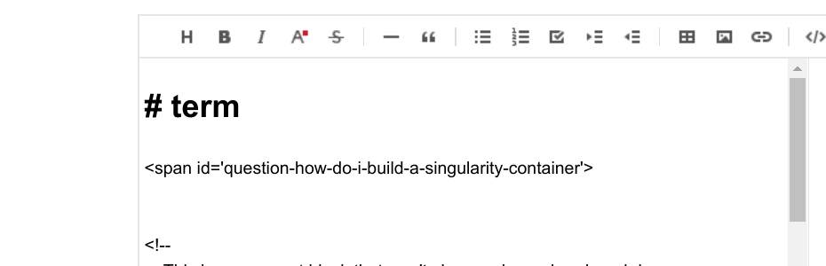

Upon submit, review, and merge, the question would appear in the list rendered alongside the article.

## Create a New Article

When you create a new article, it comes down to forking the [template repository]({{ site.baseurl }}/docs/repository-spec/)
that is ready to go with workflows to maintain content between the server and repository.

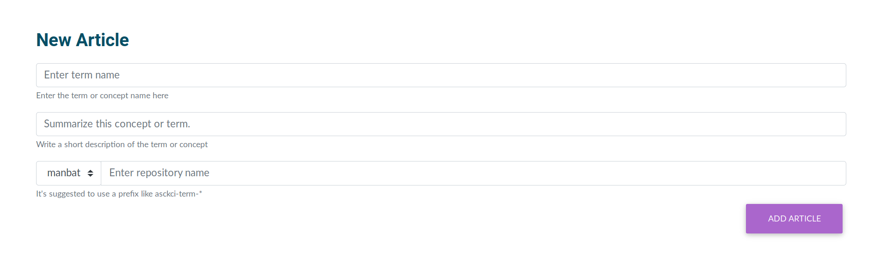

The server determines the namespaces (e.g., GitHub username and organizations) that the
authenticated user is allowed to fork to. The user also provides a term, repository name, and summary for the page.
When the submission is done, the repository has been forked and renamed appropriately, and
the user can start editing the content.

## Download or Export

Each article has buttons (shown above) to export the markdown text file or json,
and there is also a global "Export" page to download a listing (csv) of repositories connected,
or the entire content via json.

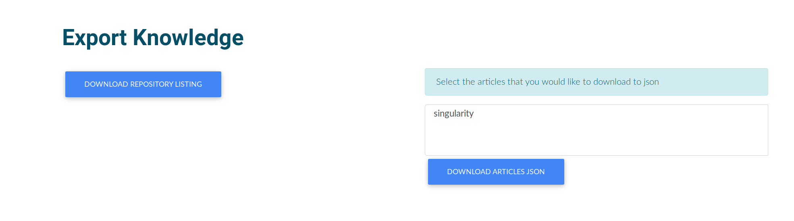

## API

The server has an application programming interface (API) that will make it easy to develop tools,
and otherwise interact with the server's content programmatically.

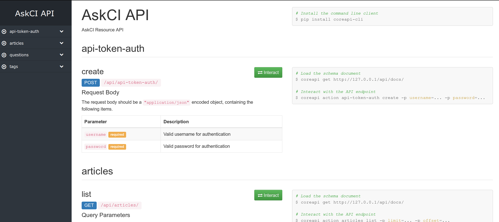

Authentication is done via the user token, shown in the profile settings above.

## More to come!

More is under development, but these are the currently implemented views.
See the [repository]({{ site.repo }}) for the code (and issues being worked on) 
or [open an issue]({{ site.repo }}/issues/new) if you have a question
