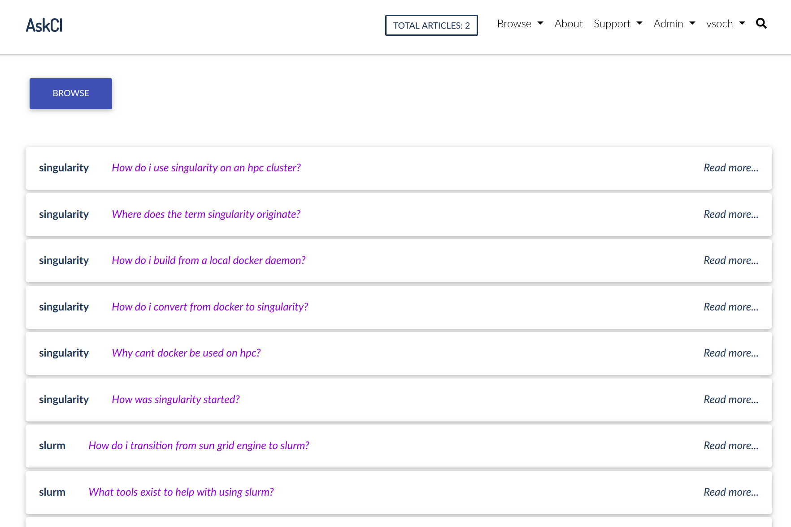
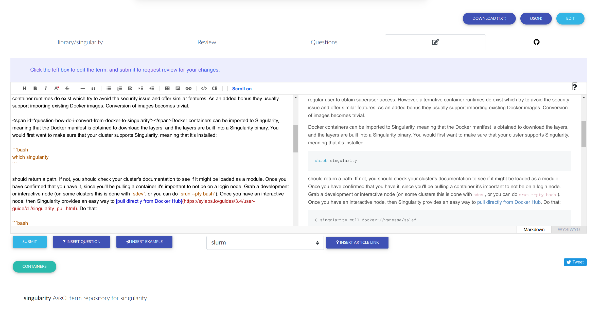

# Summary

Institutional knowledge about resources at academic centers pertaining to high performance computing,
research software, and other ideas or concepts centered around cyberinfrastructure have historically been
siloed. A research computing center is likely to provide documentation specific to their resources, or 
a small technology group to provide support catered to their user base. Although there are benefits to
maintaining isolated and specific documentation, the drawbacks for the community can be substantial.
A researcher using the documentation typically experiences a large set of technologies in synchrony,
and would benefit from a more global context that captures knowledge across support groups.
 It is common to see redundancy in academic documentation bases, as many research groups or resources tend to use
similar technologies. By way of having small teams work on these documentation bases, the potential for
stale or outdated material is large. The negative consequences largely fall on the user, as they must
sift through several online resources to put together a current, holistic picture of a concept or tool.
The negative consequences also fall on the centers, as they struggle to support the user bases with
smaller teams, and have limited time to allocate to support and documentation. In that support by way
of tickets or in-person help is essential, documentation usually falls to the wayside.
Badly needed is a collaborative solution to take the burden off of any individual center or group, and
one that moves knowledge into the open source domain.

## Concepts

AskCI Server [@askci-server] is a version controlled, collaborative knowledge and support server. It
introduces the powerful concept of open source knowledge, or bringing best practices from open source development
to the maintenance of knowledge. This means that knowledge is version controlled, worked on collaboratively
across institutions, available programmatically, and syndicated in a central location. 
Specifically, AskCI Server is defined by the following concepts:

 - **Articles**: Topics or concepts that a user might want to ask a question about. On a high level, it's a piece of knowledge that can be collaboratively worked on. On a functional level, an article corresponds to a single GitHub repository based on a template specification that allows for interaction with the server [@tech-spec].
 - **Questions and Examples**: Embedded inquiries or code snippets in an article that are indexed and searchable. A user can search and find a specific question, and then be taken immediately to the location in an article's text where the answer resides.
 - **Reviews**: Are submit by an authenticated user on the site, and map to pull requests (PRs) on GitHub [@github-pr]. In the same way that pull requests can be used to discuss changes of software, the environment is equally friendly to discuss changes to knowledge articles.
 - **User**: Can be a visitor (non-authenticated), an editor or reviewer (authenticated but without ownership of knowledge repositories) or an owner (authenticated with ownership). Visitors can browse content, editors and reviewers can update or ask new questions, and owners can do all of the above plus serve as maintainers for the knowledge repositories.

In practice, this means that content is created, worked on, and updated on GitHub [@github], and each article (repository) corresponds to a single concept or idea, akin to Wikipedia [@wikipedia]. Interactions between GitHub and the AskCI Server are automated via webhooks and GitHub workflows. Since questions are embedded in articles and then indexed by the server, a user is allowed to ask a question via the interface or a connected tool to easily find an answer or code snippet example. 

## The AskCI Community

AskCI Server is branded alongside the discourse server ask.ci [@askci] as the two can serve different needs for the same community.  
However, the two serve distinct use cases. While the discourse ask.ci [@askci] is akin to a discussion based forum where concepts might appear on many topics scattered across the site, AskCI Server [@askci-server] provides a single article for each concept. While the discourse ask.ci [@askci] is intended to provide support forums for individual centers (categories called "locales"), AskCI Server acts more like a wiki with articles for meta- or super- concepts such as a container technologies, job managers, or software projects. In fact, there is a logical progression for high quality bits of content from the ask.ci discourse site to wind up on the AskCI Server, 
and a [webhook](#webhooks) is set up to enable this process. 


## Use Cases

The discourse installation ask.ci [@askci] provides a discussion forum for many academic centers to answer questions about cyberinfrastructure. Topics on ask.ci do not represent holistic knowledge, but rather individual questions that a
user would still need to browse through to form some cohesive understanding. 

 AskCI Server can support the following properties and use cases:

### Version Control

In that each article, a concept or idea, is maintained under version control [@github], this means that 
a history is kept for all changes over time pertaining to its development. If an AskCI Server itself
were to go away for any reason, the repositories and knowledge would live on, and could easily be imported
into another deployment.

### Asking Questions

A user browsing the site is first presented with the most recent articles and associated questions (Figure 1),
and the site is organized to make it easy to browse articles, reviews under progress, or embedded questions and
examples.



The user is also able to easily search all content across the site, which are also made available
via the AskCI Server Application Programming Interface (API). Command line tools to stream line
asking and answering questions will be developed using this API.

While not visible in the rendered markdown, questions and examples are embedded in the content
by way of span tags. A question span can appear anywhere in the text, and marks the location where
the answer beings. An example question might look like this:

```html
<span id="question-where-does-the-term-originate"></span> The term originates from...
```

The same kind of tag can be used for an example, except it would appear before a code block.
Both of these structures are tested automatically, discussed next.

### Automation

#### Workflows

Each term repository is based on a common template that comes with GitHub Workflows [@github-workflows] that
can fully automate management of the term. These workflows include:

 - **Testing**: Testing of the term content, or the README.md maintained in the repository, comes down to parsing the text for correctly structured example and question spans. The content is tested in the repository, and submissions are also tested on the server. A user that is requesting review is not be able to submit until validation passes.
 - **Request for Review**: A request for review is done by way of a dispatch event [@github-dispatch] that is identified based on a client metadata field, "request-review." When a user edits content and submits it for review, the dispatch event will receive the updated content, open up a new branch on the repository with the content, and open a pull request. The submitting author is notified on the pull request to allow for further discussion, and the pull request is linked from the term interface and site for others to see and give feedback on.
 - **Template Update**: An update to the template would be highly challenging if the template was used across, say, hundreds of repositories. To support ease of updating, a dispatch event exists identified based on a client metadata field "update-template" that can be triggered by an administrator of the server to update all or a subset of templates. An update comes down to cloning the upstream template, and updating the hidden `.github` folder scripts that drive the application. A pull request is opened for the term maintainers to review the changes.

#### Webhooks

Along with workflows, webhooks are essential for keeping the latest content on GitHub in sync with the server. Webhooks are created automatically when a new term is added, which also coincides with creating a newly named copy of a term template. Webhooks include:

 - **Push or Deployment**: Any update of the term content in its README.md that is pushed to the master branch notifies the server. The server validates the webhook, and then updates content on the server from the repository. 
 - **Pull Request**: As pull requests are linked from the server to solicit additional review, it's essential that any changes in status are also kept in sync. Whenever a pull request status is changed, the server is notified, and acts accordingly. For example, a pull request closing without a merge would result in a status of "rejected" for the review, while a pull request with a merged time stamp would indicate that it was accepted and closed.
 - **Repository**: In the case that any information about a repository changes, including the name, owner, or metadata, a webhooks is triggered to update the server. If the name is changed to be outside of the AskCI Server namespace (in the format `askci-term-<term>`) or if any subsequent actions on the repository are not successful, then the repository is marked as archived on the server. Archived means that further updates will not happen unless the permissions or metadata issues are resolved.

#### Notifications

For all of the above cases, in that a request for review, template update, or repository archive occurs,
owners are notified by way of an email powered by the SendGrid API [@sendgrid]. Users that contribute
content to repositories are also subscribed to receive further notifications, a status that they can
easily remove if desired.

### Contributing Content

There are several ways for which incentive exists for generating updated content.

 - **Contributor**: Any authenticated user, even with minimal GitHub permissions, can edit an article, and then submit the changes to the open source knowledge maintainer for review (Figure 2). This is likely to happen if a user is browsing the site and sees content that he or she would like to update.
 - **Asking Questions**: If a browsing user cannot find an answer to a question on any particular topic, he or she can easily click on "Ask a Question" and input the question content. The question is submit as an issue on a term GitHub board, and brought to the attention of the open source knowledge maintainer. This question asking most likely will happen in a web interface, but could also programmatically happen by way of the application programming interface.
 - **Discourse Webhook**: An external webhook can be configured to ping the AskCI Server when there is a post on an external discourse board. In the case of ask.ci [@askci], a post would come down to a user asking a specific question about some cyberinfrastructure topic. The AskCI Server parses the content, matches terms to existing terms on the server, and if a match is found, opens up an issue on GitHub to alert the maintainer that new knowledge exists that might be integrated into the resource.



The webhook framework is generalized, so if another resource is desired to notify the server of relevant content, this can be easily implemented.

## Server Design

### Authentication

There are four levels of roles provided by AskCI Server, three of which are available to the larger community.

 - **Viewer**: Any unauthenticated user is allowed to browse knowledge on the site, including articles, questions, reviews, and examples.
 - **Editor**: Is a role associated with allowing read only access for the minimum set of public information provided by GitHub OAuth2 [@github-oauth2]. An editor is able to interactively edit the article content in the interface, and then submit the changes as a request for review.
 - **Owner**: Is a role associated with read and write permissions required to copy template repositories and create webhooks on the user's behalf. An owner can easily generate new knowledge repositories for terms or concepts that do not exist yet. An owner is then responsible for being one of the maintainers of the term on GitHub, and will receive notification for reviews or new questions. If a repository is generated in a GitHub organization, this responsibility can be shared by a group of individuals with shared expertise, and this is the recommended approach.
 - **Admin**: A site administrator is considered a staff or superuser of the application, meaning that she has full access to manage the site. Typically an admin would be responsible for responding to issues with respect to the site, updating templates when necessary, or setting up webhooks. In practice, this is typically one individual, this author.

The flexibility with respect to roles allows for a user of the server to participate at whatever level is comfortable
for him or her. Some will want to read passively, others will want to contribute content without taking on responsibility, and
a third group will want to serve as open source knowledge maintainers.


### Containers

The AskCI Server is made possible by way of several Docker [@docker] containers, including:

 - **askci_base**: A uwsgi [@uwsgi] container that runs the main Django [@django] application
 - **askci_worker**: A `django_rq` [@django-rq] worker that can run asynchronous tasks
 - **askci_scheduler**: A scheduler for the worker
 - **askci_redis**: The redis database for the scheduler
 - **askci_postgres**: A database for the application. For production, it's suggested to use a database outside of a container.

These containers are deployed locally or in production by way of docker compose [@docker-compose]. A shell script, `askci.sh` is provided alongside the application for easier interaction to deploy or manage a development or production interface.


## Discussion

### Scope of Use

While this particular example has scoped the AskCI Server to be about research computing and technology support,
an AskCI Server can easily be branded to support any kind of knowledge that can be maintained on GitHub. The setup steps walk the user through the server naming, and this can be easily changed. While the main
README.md was selected for this early template so that the main repository also renders the knowledge content, for a software repository
that uses the main README.md for other purposes, a template could be customized to render one or more different files.
An AskCI Server could easily be branded to serve metadata about software, medical or biological knowledge, or specifications.
Further, by way of the application programming interface, an AskCI Server can be integrated with an external
ticketing system, support queue, or similar.

### Development

The beauty of the design of this documentation base is that knowledge repositories, even if disconnected from
a central server, can be imported easily into a new server. For this reason, articles that are written during the development
of an AskCI Server will integrate easily into a production server. For more details about usage and development, screen shots, and
links, see the official documentation at https://vsoch.github.io/askci [@askci-server].


# References
